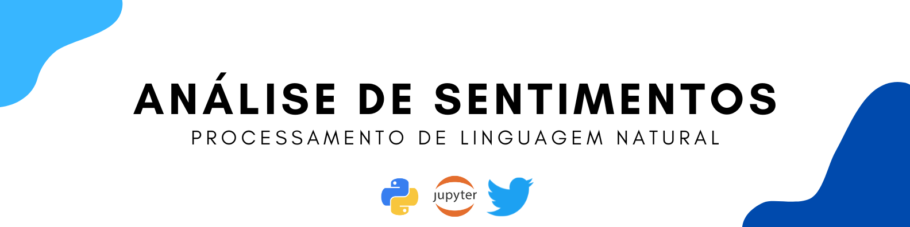

Este é um projeto de Processamento de Linguagem Natural (PLN).

O conjunto de dados utilizado está disponível [neste link](https://www.kaggle.com/c/i2a2-nlp-2021-sentiment-analysis/data). 

# Entendimento do Negócio

Imagine uma empresa que quer saber sobre a repercussão de uma campanha de marketing que foi lançada no mercado. É possível usar as redes sociais para buscar informações, mas como saber se estão falando bem ou mal dessa campanha? Ler, entender e tirar uma conclusão de milhares de comentários de usuários pode ser uma tarefa inviável.

É nesse cenário que o objetivo desse projeto se enquadra. Iremos desenvolver um modelo de aprendizado de máquina capaz de classificar tweets sobre um determinado tema em positivo ou negativo. Aqui, não iremos avaliar nenhuma campanha, produto ou serviço de uma empresa específica, em vez disso, utilizaremos tweets relacionados a Black Friday, um tema mais "genérico" que não irá expor nenhuma empresa.

O grande desafio desse projeto se dá porque não existe um conjunto de dados de tweets pré-etiquetados para treinar o modelo, então, para a fase de treinamento utilizaremos outros dados de contexto parecido, o de avaliações do grupo B2W Digital. Este grupo é responsável pelas lojas Submarino, Shoptime e Americanas.

Outro desafio desse projeto é em relação a linguagem das mensagens publicadas no Twitter que, em geral, contém gírias, ironias, e caracteres especiais, então, teremos de realizar o pré-processamento nesses dados, para que o modelo consiga classificar textos que "nunca viu antes" de forma satisfatória. Para isso, será utilizado o algoritmo *Multinomial Naive Bayes*, que é um modelo probabilístico baseado na frequência de um termo e excelente para classificação de documentos.

# Dicionário de Dados

Como descrito acima, iremos utilizar o conjunto de dados do grupo B2W Digital para o treinamento do modelo.

Esse conjunto está dividido em dois arquivos, "train.csv" e "test.csv", porém, iremos utilizar apenas o conjunto de treino e os seguintes atributos:

| Variáveis                        | Descrição                              |
| -------------------------------- | -------------------------------------- |
| review_text                      | Texto principal da avaliação           |                          
| rating                           | Nota atribuída a avaliação, de 1 a 5   |

# Estratégia da Solução

Como estratégia para a solução do projeto, definimos as seguintes etapas:

- **1. Entendimento do Negócio:** nessa etapa inicial, realizamos uma breve introdução sobre o tema do projeto e definimos nossos objetivos.

- **2. Entendimento dos Dados:** nessa etapa, definimos o conjunto de dados que iremos utilizar e realizamos um tratamento a fim de verificar possíveis inconsistências nos dados.

- **3. Pré-Processamento dos Dados:** o principal objetivo nessa etapa é realizar a preparação dos dados para a modelagem. Entre as práticas abordadas nessa sessão estão: balanceamento de classes, limpeza dos dados, lematização e transformação dos dados em vetores numéricos.

- **4. Modelagem Preditiva:** aqui, iremos criar o modelo preditivo utilizando o algoritmo *Naive Bayes*. Como métricas de avaliação, verificaremos a *accuracy*, *recall*, *f1 score* e também a matriz de confusão.

- **5. Similaridade de Dados:** esta etapa foi inserida como uma análise adicional que tem como objetivo verificar as similaridades entre as palavras mais frequentes. Para a realização dessa tarefa utilizamos o algoritmo *Word2Vec*.

- **6. Classificando Tweets:** esta etapa se refere ao objetivo principal do projeto. Com o modelo treinado, iremos realizar a coleta de uma nova base de dados diretamente do Twitter, utilizando a própria API da rede social. Após isso, iremos apresentar esses dados ao modelo preditivo para analisarmos a sua performance.

- **7. Conclusões Finais:** por fim, aqui, iremos deixar nossas conclusões finais do projeto.

# Pré-Processamento dos Dados

Uma das principais tarefas envolvendo a etapa de pré-processamento dos dados foi em relação a criação dos rótulos da variável resposta. Para esse projeto, precisávamos de um conjunto de dados com os rótulos "positivo" e "negativo". 

Nesse sentido, separamos as classes da variável **`rating`** da seguinte forma:

- Avaliações com valores 1 e 2 foram consideradas negativas.
- Avaliações com valor 5 foram consideradas positivas.

Após essa separação, selecionamos 20.000 amostras de cada conjunto, resultando em um corpus igualmente distribuído. Além disso, também foi necessário realizar a limpeza dos dados, deixando-os apropriados para a modelagem preditiva. 

As principais tarefas abordadas foram: 

- Remoção de palavras irrelevantes e acentuações.
- Substituição de letras maiúsculas por minúsculas.
- Lematização.
- Conversão de textos para vetores numéricos.

# Modelagem Preditiva

 O algoritmo *Multinomial Naive Bayes* foi o escolhido para realizar a classificação dos tweets. 
 
 Abaixo segue as métricas alcançadas com os dados de teste: 
 
|    Classe      | ***Accuracy***  | ***Precision*** | ***Recall***    | ***F1-score***  |
|:--------------:|:---------------:|:---------------:|:---------------:|:---------------:|
| Negativo       | 0.92            | 0.90            | 0.94            | 0.92            |
| Positivo	      | 0.92            | 0.94            | 0.90            | 0.92            |
 
 # Classificando Tweets
 
Para realizar a coleta dos tweets utilizaremos a biblioteca *Tweepy*, uma das mais utilizadas para esse tipo de tarefa. Foram coletados 500 tweets, que passaram pelo mesmo pré-processamento dos dados de treino. 

Para assegurar um melhor resultado, consideramos somente os tweets em que as probabilidades de classificação foram maiores que 85% e menores que 10%.

# Conclusões Finais

O maior desafio desse projeto estava em não possuir um conjunto de dados pré-etiquetados para o treinamento do modelo. Por conta disso, utilizamos um conjunto com dados similares ao tema abordado.

Durante a fase de preparação dos dados, aplicamos técnicas amplamente utilizadas em PLN e que foram cruciais para o modelo conseguir interpretar as informações e realizar as classificações em um conjunto de dados relativamente diferente do que foi utilizado para seu treinamento.

Em relação ao desempenho do modelo treinado com o algoritmo *Naive Bayes*, conseguimos um resultado bastante satisfatório. Podemos perceber que para alguns tweets, o modelo teve maior dificuldade para realizar as classificações, e por esse motivo, consideramos apenas as classificações mais assertivas.

Apesar desse projeto ter uma complexidade de nível básico em PLN, poderíamos utilizar as mesmas abordagens vistas aqui para treinar um modelo capaz de classificar tweets referentes a qualquer tema, e assim, auxiliar as áreas de interesse a tomar as melhores decisões para a empresa.

# Autor

Rafael Felippe  

 
